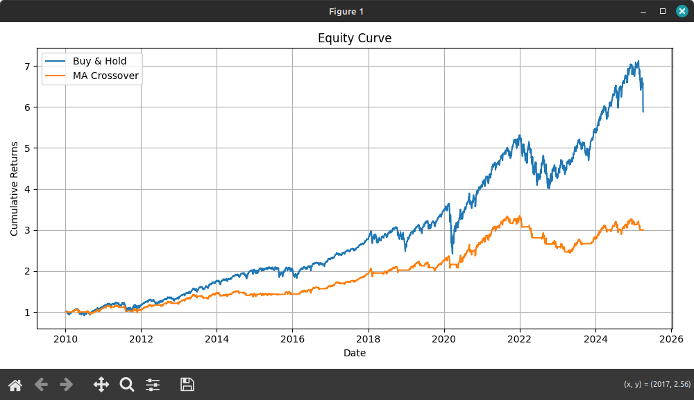

# 📈 Quant Backtester

A lightweight, modular backtesting engine to simulate trading strategies on historical stock data and evaluate their performance.

---

## 🚀 Features

- Runs backtests on historical data from CSV files
- Implements plug-and-play trading strategies
- Computes key performance metrics:
  - **CAGR**
  - **Sharpe Ratio**
  - **Maximum Drawdown**
- Visualizes equity curves

---

## 📸 Demo



---

## ⚙️ How to Use

```bash
git clone https://github.com/your-username/quant-backtester-python.git
cd quant-backtester-python
pip install -r requirements.txt
python main.py
```

> Make sure your data is stored in the expected format (see `data_loader.py` for details).

---

## 💡 Included Strategies

- **Buy & Hold** – simple benchmark
- **Moving Average Crossover** – buys when short-term MA crosses above long-term MA

New strategies can easily be added as standalone modules in the `src/` directory.

---

## 📊 Performance Metrics

| Metric         | Description                                                  |
|----------------|--------------------------------------------------------------|
| **CAGR**       | Compound Annual Growth Rate                                  |
| **Sharpe Ratio** | Risk-adjusted return (using daily returns, annualized)     |
| **Max Drawdown** | Worst peak-to-trough equity drop during the backtest       |

---

## 🧐 Why this project?

This project was created as a personal exercise to:

- Explore quantitative finance and algorithmic strategy evaluation
- Build a flexible backtesting framework from scratch
- Learn and apply Python, Pandas, NumPy, and Matplotlib in a real-world use case

---

## 📂 Project Structure

```
├── main.py                   # Main script to run a backtest
├── requirements.txt          # Python dependencies
├── src/
│   ├── data_loader.py        # Loads data from CSV
│   ├── performance_metrics.py# Calculates financial metrics
│   ├── plotter.py            # Plots equity curve
│   ├── strategy_buy_hold.py  # Buy and hold logic
│   └── strategy_ma_crossover.py # MA crossover logic
├── screenshots/
│   └── equity_curve.png      # Sample output
└── README.md                 # This file
```

---

## 📬 Contact

Project by [Gabriele Tiboni](https://github.com/tibonigabriele) – Feel free to reach out for feedback or collaboration!https://github.com/tibonigabriele
