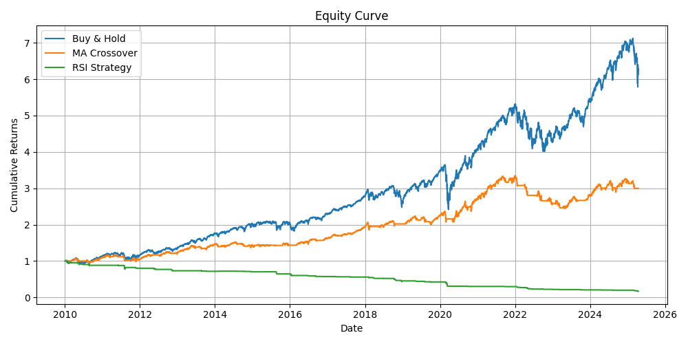

# 📈 Quant Backtester

A lightweight, modular backtesting engine for evaluating trading strategies on historical stock data.  
Perfect for learning quantitative finance, comparing strategies, and building your own framework.

---

## 🚀 Features

- CLI interface with interactive menu
- Fetches historical stock data via Yahoo Finance
- Modular strategy architecture (easy to add your own)
- Computes performance metrics:
  - **CAGR**
  - **Sharpe Ratio**
  - **Max Drawdown**
- Grid Search for:
  - **Moving Average Crossover**
  - **RSI Strategy**
- Saves results in CSV and visualizes equity curves

---

## 📸 Demo



---

## ⚙️ How to Use

```bash
git clone https://github.com/tibonigabriele/quant-backtester-python.git
cd quant-backtester-python
pip install -r requirements.txt
python main.py
```

> Make sure you're connected to the internet: the script fetches data using `yfinance`.

---

## 🧠 CLI Menu

```text
What would you like to do?
1. Run base strategies (Buy & Hold, MA, RSI)
2. Launch MA Crossover grid search
3. Launch RSI grid search
4. Exit
```

---

## 💡 Included Strategies

- **Buy & Hold** – benchmark strategy
- **Moving Average Crossover** – customizable short/long windows
- **RSI Strategy** – buy when RSI < 30, sell when RSI > 70

---

## 📊 Sample Grid Search Output

### 📉 MA Crossover Results (`results/ma_crossover_results.csv`)

| Strategy     | CAGR   | Sharpe Ratio | Max Drawdown |
|--------------|--------|---------------|---------------|
| MA 10-200    | 0.1122 | 0.95          | 0.1377        |
| MA 10-100    | 0.1018 | 0.90          | 0.1966        |

### 🔄 RSI Strategy Results (`results/rsi_grid_search_results.csv`)

| Strategy     | CAGR   | Sharpe Ratio | Max Drawdown |
|--------------|--------|---------------|---------------|
| RSI 10-20-80 | 0.0954 | 0.87          | 0.1456        |
| RSI 14-30-70 | 0.0889 | 0.81          | 0.1823        |

Both outputs are automatically ranked using a weighted performance score.

---

## 📂 Project Structure

```
quant-backtester-python/
├── main.py                     # Entry point with CLI menu
├── requirements.txt            # Python dependencies
├── LICENSE                     # MIT License
├── README.md                   # This file
├── results/                    # CSV files from grid search
├── plots/                      # Saved equity curve images
├── src/
│   ├── data_loader.py
│   ├── performance_metrics.py
│   ├── plotter.py
│   ├── print_metrics.py
│   └── strategies/
│       ├── buy_hold_strategy.py
│       ├── ma_crossover_strategy.py
│       └── rsi_strategy.py
└── analysis/
    └── grid_search.py      # tuning logic
```

---

## 📬 Contact

Project by [Gabriele Tiboni](https://github.com/tibonigabriele)  
Feel free to reach out for feedback or collaboration!