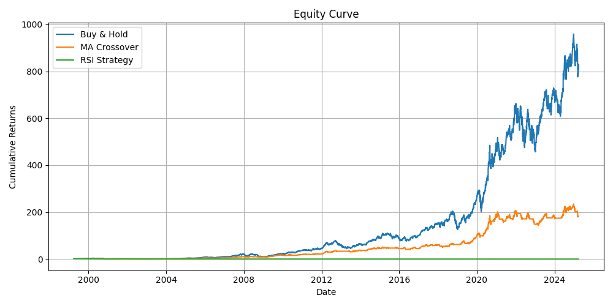

# 📈 Quant Backtester

A lightweight, modular backtesting engine to simulate trading strategies on historical stock data and evaluate their performance.

---

## 🚀 Features

- Fetches historical data via **Yahoo Finance**
- Plug-and-play strategy system
- Support for **rule-based strategies**
- Computes key performance metrics:
  - **CAGR**
  - **Sharpe Ratio**
  - **Maximum Drawdown**
- Visualizes equity curves with **Matplotlib**
- Supports strategy parameter testing (e.g. MA grid search)

---

## 📸 Demo



---

## ⚙️ How to Use

```bash
git clone https://github.com/tibonigabriele/quant-backtester-python.git
cd quant-backtester-python
pip install -r requirements.txt
python main.py
```

> Make sure you're connected to the internet: the script fetches data using `yfinance`.

---

## 💡 Included Strategies

- **Buy & Hold** – Benchmark strategy
- **Moving Average Crossover** – Long when short MA > long MA
- **RSI Strategy** – Long when RSI < 30, exit when RSI > 70
- **Rule-based framework** – Easily define custom entry/exit logic

---

## 📊 Performance Metrics

| Metric           | Description                                                 |
| ---------------- | ----------------------------------------------------------- |
| **CAGR**         | Compound Annual Growth Rate                                 |
| **Sharpe Ratio** | Risk-adjusted return (daily returns, annualized)            |
| **Max Drawdown** | Largest peak-to-trough equity drop during the backtest      |

---

## 🧪 Grid Search Example

You can test parameter combinations by running:

```bash
python analysis/test_ma_grid_search.py
```

This script evaluates different MA crossover windows and plots their performance.

---

## 📂 Project Structure

```
quant-backtester-python/
├── main.py                     # Runs selected strategies and plots results
├── requirements.txt            # Python dependencies
├── LICENSE                     # MIT License
├── README.md                   # Project overview
├── plots/
│   └── equity_curve.png        # Saved equity curve
├── analysis/
│   └── test_ma_grid_search.py  # Example strategy testing
└── src/
    ├── data_loader.py              # Loads data from Yahoo Finance
    ├── performance_metrics.py      # Calculates metrics
    ├── plotter.py                  # Generates equity plots
    ├── print_metrics.py            # Prints results
    ├── rules/                      # Strategy rules
    │   ├── base_rule.py
    │   ├── ma_crossover_rule.py
    │   └── rsi_rule.py
    └── strategies/                # Strategy implementations
        ├── buy_hold_strategy.py
        ├── ma_crossover_strategy.py
        ├── rsi_strategy.py
        ├── rule_based_strategy.py
        └── strategy_base.py
```

---

## 📬 Contact

Project by [Gabriele Tiboni](https://github.com/tibonigabriele)  
Feel free to reach out for feedback or collaboration!

